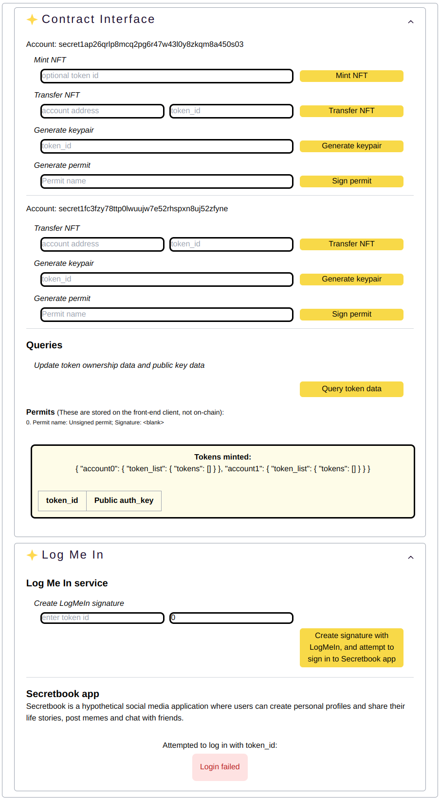
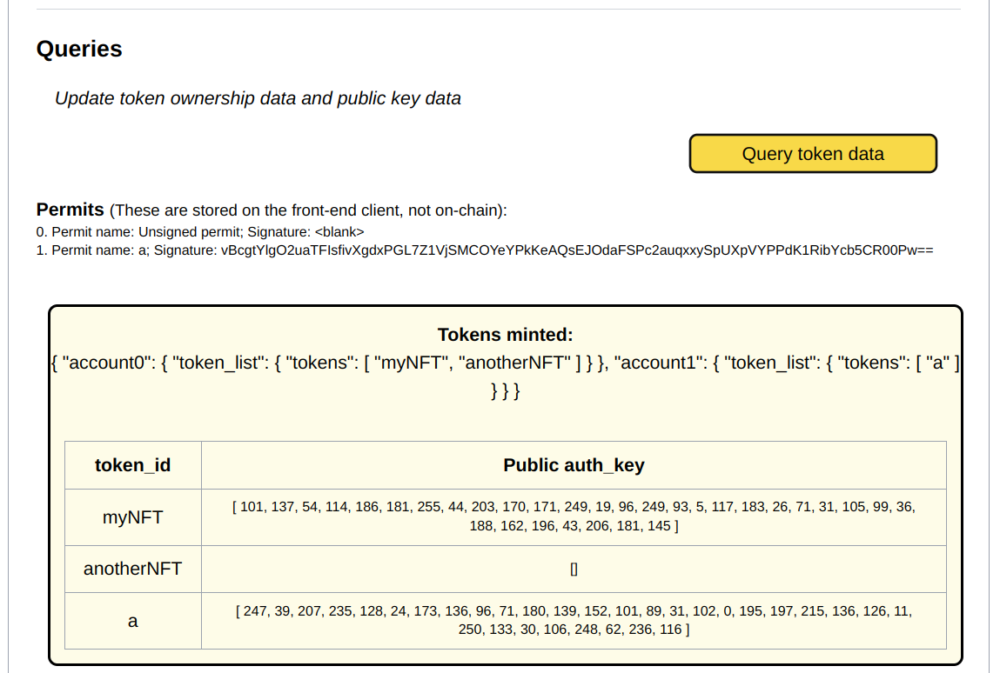

# Logmein Box Tutorial

## Introduction

Welcome to the Logmein Box tutorial! In this tutorial, we will implement cryptography at the contract level, and use it as a log in tool. The this contract is mostly based on [this](https://github.com/srdtrk/nft-authorization), but we implement it slightly differently in this box, particularly the cryptographic scheme.

Using cryptography at the contract level can be complex, and it’s easy to have vulnerabilities if you don’t fully understand the cryptography. Alas, this contract is not suitable for production-level use. Our goal is to demonstrate concepts and help you learn new things to develop your own production-level dapps. We’ll discuss some of the issues later in the lesson. Perhaps you could find ways to solve these issues and create an actual user-facing login dapp?

This SecretBox is meant to be completed on your local environment. You can follow the “Getting Started” steps in the [README of this repo](https://github.com/secretuniversity/logmein-vuejs-box/blob/main/README.md) to set everything up. Gitpod is not supported for this box, but we have the gitpod.yml file which is meant to set up your environment on Gitpod, if you wish to try doing this on Gitpod. 

## Prerequisites

We assume you are familiar with building simple Secret contracts, including implementing viewing keys and permits. If not, check out our [RichieRich Secret Box](https://github.com/secretuniversity/richie-rich-vuejs-box) and [Viewing Key and Permit pathway](https://scrt.university/pathways/33/implementing-viewing-keys-and-permits).


In addition, we assume you have a basic understanding of the role of private and public keys in asymmetric cryptography. You don’t need to understand the math behind it. If you’ve spent any time in blockchain, you’ll be familiar with private and public keys – a non-technical user will know the public key as the “account address” that anyone can view. The private keys are what you should never share with anyone and what crypto scammers are always after!

Private keys can cryptographically sign messages, which can be verified using the corresponding public key. If the verification passes and the signer is the only party possessing the private key, we can be confident that the signed message originated from the intended sender (not forged) and that the message content hasn’t been tampered with. If you understand this conceptually, it’s enough to follow our tutorial.

We also use a similar design for the front-end as we did with other boxes. It might be worth looking at RichieRich for example, to understand how we implemented permit creation, which is done by the front-end application.


## Contract overview

In our box, we have these hypothetical services:
- Secretbook, a hypothetical social media application that the user wants to log into. We’ll refer to our web app simply as Secretbook to mean “any web application that can accept a login using the Logmein service.”
- Logmein, a service that sits between the user and the web app. This service could be offered by a third party (like a password manager) or directly controlled by the user. The Logmein contract implements this service.

The idea is to allow the user to log into Secretbook by owning a Secret NFT. The Logmein service enables users to prove ownership of the NFT without revealing their account address directly to Secretbook. This is done using a modified SNIP721 reference implementation contract (which implements Secret Network’s NFT standard with additional features). The modified NFT contract allows users to create a cryptographic key pair. The public key is stored in the public metadata and the private key in the private metadata.

When the user wants to log into Secretbook, these steps occur:
- Secretbook randomly generates an arbitrary message and shares it with the user.
- The user connects with Logmein, which requests permission to view the private metadata.
- Logmein uses the private key stored in the private metadata to sign the message Secretbook generated, producing a digital signature.
- The digital signature is then handed to Secretbook to verify. Secretbook verifies the signature against the public key stored in the NFT’s public metadata. If successfully verified, it means that the user indeed owns that NFT, as they wouldn’t have been able to access the private key to sign the randomly generated message otherwise.

Of course, there are some issues with this implementation, such as the need to trust the Logmein service. We’ll discuss this and other issues later in the lesson. But for our Secret Box exercise, our goal is to implement this design as a first step towards an actual login service.


## Web application overview

In addition to the contract itself, we also have a web application frontend as part of this box. We will use secret.js and Vue.js, walking through the required code to get a front end application to interact with the Secret contract. The frontend GUI design itself is intended to help developers understand the mechanics of the Logmein design. Like most of our other contract-focused boxes, the GUI isn’t streamlined in a way that’s suitable or intended for end-users.

Of course, if you want, you can implement a GUI more suitable for an end-user facing app, which will primarily be a "pure" Web2 undertaking. We won't cover this, as our focus for ths box is the interface between the front-end and the contract and the signature verification process done by Secretbook.

## Tutorial starting point

Start by opening the Secret box in your local environment. 

If you followed the guide on setting up your local environment, you should have these three terminal windows open:
- LocalSecret: displays the blockchain starting up and producing blocks
- Secret Box workspace: where you will compile and deploy your contract and enter commands as you go through this tutorial
- Web application frontend: where you will launch your application server after LocalSecret is running and the Secret contract has been created

The files you will be working with are:
- `src/*` : these are the contract source files
- `app/src/components/SecretBox/*` : these are the front-end source files

In these files, look for sections marked with comments such as `// complete code here`. These are the core parts of code required to implement authenticated queries.


## Logmein contract design

The Logmein contract is a modified Secret NFT. It has all the features of a SNIP721 token, with a few additions:
- It accepts an additional execute message to generate a new keypair.
- A new keypair gets generated when the token is transferred.
- (Optional): A keypair is automatically created when the token is minted.

The last item, which is optional, is not implemented in this Secret Box. However, we left some incomplete code commented out for you to implement this if you are up for the challenge. There are pros and cons to doing this. Automatically generating a keypair when a token gets minted means there will always be a keypair stored on the NFT, which may have some benefits if you definitely want to use this keypair feature.

As a modified NFT, a logical first step is to fork the SNIP721 reference implementation. This contract is a fork of the [SNIP721 reference implementation](https://github.com/baedrik/snip721-reference-impl). Specifically, this particular box forked commit ed7c59d, which was made on 4th Jan 2023.

There are probably more scalable ways than forking the SNIP721 reference contract, such as importing the SNIP721 contract or creating a mod. However, that is beyond the scope of this Secret Box.


### Exercise: Defining the GenerateKeypairs message

Our modified SNIP721 needs to accept an execute message with this JSON schema:

```json
{
    "generate_keypairs": {
        "token_id": "string",
        "entropy": "string"
    }
}
```

...where the entropy field is optional.

In other words, if a user wishes to generate a new keypair on an NFT, they send this execute message specifying the token_id and an optional entropy string which is used to randomly generate a new private and public key in the NFT metadata.

Navigate to msg.rs. Your task is to add this variant to the ExecuteMsg enum.

<details> <summary> Solution: </summary>

```rust
pub enum ExecuteMsg {
    // ...
    GenerateKeypairs {
        token_id: String,
        entropy: Option<String>,
    },
}
```
</details>

### Exercise: Adding keypair to the Extension struct

Next let's modify the token. In the token.rs file, we define the `Token` struct, which stores important information about the token. We also define the Metadata struct, which has all the information that can be stored in the token's metadata. These are part of the standard SNIP721 implementation. Notice Metadata has a field called extension, which stores on optional Extension type. In the Extension struct, let's add the ability to store the keypair required for Logmein. Let's call the field `auth_key`. This should be a 32-byte array, which represents a 256-bit number. Note a byte can be represented by a u8 type.

Your task is to add this field in the Extension type.

<details> <summary> Solution: </summary>

```rust
pub struct Extension {
    // ...
    pub auth_key: Option<[u8; 32]>
}
```
</details>

### Exercise: defining a method to add auth_key

We want the Metadata type to have a method called `add_auth_key` which accepts a 32-byte array and assigns that as the token's auth_key. It should not modify any existing information in the token's metadata. 

There are several ways to implement this. In our code, we have implemented this method on both Metadata and Extension. Your task is to complete this code. Note that if there is a token_uri (ie: metadata that is stored off-chain), it will throw an error.

<details> <summary> Solution: </summary>

```rust
impl Metadata {
    pub fn add_auth_key(&self, new_key: &[u8; 32]) -> StdResult<Metadata> {
        // ...

        let ext = &self.extension.clone().unwrap_or_default();

        Ok(
            Metadata {
                token_uri: None,
                extension: Some(ext.add_auth_key(new_key)),
            }
        )
    }
}

impl Extension {
    fn add_auth_key(&self, new_key: &[u8; 32]) -> Extension {
        Extension {
            auth_key: Some(*new_key),
            ..self.clone()
        }
    }
}
```
</details>

### Exercise: handling the GenerateKeypairs execute message

In the execute entry point function, we need to handle the new variant we defined in ExecuteMsg. Add that in the match arm of the execute entry point function.


<details> <summary> Solution: </summary>

```rust
    ExecuteMsg::GenerateKeypairs { token_id, entropy } => metadata_generate_keypair(
        deps,
        &info.sender, 
        env, 
        &config, 
        &token_id, 
        entropy
    )
```
</details>


## Functions that generate keypairs

We have a total of four new functions in contract.rs to handle generating keypairs. 
- `metadata_generate_keypair` checks that the message caller is indeed authorized to generate keypairs for the token. If so, we call the next function, `metadata_generate_keypair_impl`. Otherwise, we throw an error.
- `metadata_generate_keypair_impl` calls the `generate_keypair` function using the prng seed as input, before updating this seed. Then, it modifies the NFT's private and public metadata with the new private and public keys respectively.
- `generate_keypair` calls the `new_entropy` function to produce a random byte array based on the optional user input and prng_seed. It then uses this byte array output to generate an ed25519 keypair using the ed25519 Rust package. 
- `new_entropy` accepts an entropy string and a prng_seed as inputs. It mixes these with additional entropy, such as block time and height, to produce a random 256-bit number.

> **A note of caution generating random numbers this way**
>
> Generating numbers fully on-chain is challenging to do in a secure way. Even the ability to have a hidden prng_seed does not solve all problems for many use cases. Generating random numbers like this is mostly secure in this particular use-case. For most other applications, we recommend using Secret Networks VRF.

### Exercise: authenticating the caller

We have defined the error message. Your task is to write the logic that authenticates the message sender. The rule is to allow the following addresses to proceed:
- token_id owner 
- contract admin
- minters, only if minter_may_update_metadata (a configuration setting) is set to true


<details> <summary> Solution: </summary>

```rust
    if !( sender_raw == token.owner || sender_raw == config.admin ) {
        let minters: Vec<CanonicalAddr> =
            may_load(deps.storage, MINTERS_KEY)?.unwrap_or_default();
        if !config.minter_may_update_metadata || !minters.contains(&sender_raw) {
            return Err(StdError::generic_err(custom_err));
        }
    }
```
</details>


### Exercise: using prng_seed to call generate_keypair

Navigate to the metadata_generate_keypair_impl function. Notice there are three blocks of code to complete. Let's start with the first block, which should call the generate_keypair function using prng_seed as the input.


<details> <summary> Hint 1: </summary>
We need to retrieve the value stored in PRNG_SEED_KEY, which is used as an input to generate a keypair. We should then modify it so we don't reuse the same seed the next time a keypair is generated with this contract. Notice the generate_keypair function returns a new prng_seed.
</details>

<details> <summary> Solution: </summary>

```rust
pub fn metadata_generate_keypair_impl(
    // ...
) -> StdResult<Response> {
    // generate the new public/private key pair
    let prng_seed: Vec<u8> = load(deps.storage, PRNG_SEED_KEY).unwrap();
    let (pubkey, scrtkey, new_prng_seed) = generate_keypair(env, sender, prng_seed, entropy);
    save(deps.storage, PRNG_SEED_KEY, &new_prng_seed).unwrap();

    // ...
}

pub fn instantiate(
    // ...
) -> StdResult<Response> {
    // ...
    save(deps.storage, PRNG_SEED_KEY, &prng_seed)?;
    // ... 
}

```
</details> 

### Exercise: updating the metadata

Now let's update the NFT's metadata. Your task is to write the code for this.


<details> <summary> Hint 1: </summary>
We should update the auth_key field while keeping other metadata values unchanged. So we need to load the existing metadata first.
</details>

<details> <summary> Hint 2: </summary>
Use the add_auth_key method we implemented on the Metadata type.
</details>


<details> <summary> Hint 3: </summary>
The metadata stored in the NFT may be set to `None`. In this situation, we should create a metadata entry with default values. Import token::Extension to do this.
</details>


<details> <summary> Solution for last two exercises: </summary>

```rust
use crate::token::Extension;

pub fn metadata_generate_keypair_impl(
    deps: &mut DepsMut,
    sender: &Addr,
    env: &Env,
    entropy: Option<String>,
    idx: u32,
) -> StdResult<Response> {
    // generate the new public/private key pair
    let prng_seed: Vec<u8> = load(deps.storage, PRNG_SEED_KEY).unwrap();
    let (pubkey, scrtkey, new_prng_seed) = generate_keypair(env, sender, prng_seed, entropy);
    save(deps.storage, PRNG_SEED_KEY, &new_prng_seed).unwrap();

    // update private metadata with the private key.
    let mut priv_meta_store = PrefixedStorage::new(deps.storage, PREFIX_PRIV_META);
    let maybe_priv_meta: Option<Metadata> = may_load(&priv_meta_store, &idx.to_le_bytes())?;
    let priv_meta = maybe_priv_meta.unwrap_or(
        Metadata {
            token_uri: None,
            extension: Some(Extension::default()),
        }
    );
    let new_priv_meta =  priv_meta.add_auth_key(&scrtkey.to_bytes())?;
    save(&mut priv_meta_store, &idx.to_le_bytes(), &new_priv_meta)?;

    // update public metadata with the public key
    let mut pub_meta_store = PrefixedStorage::new(deps.storage, PREFIX_PUB_META);
    let maybe_pub_meta: Option<Metadata> = may_load(&pub_meta_store, &idx.to_le_bytes())?;
    let pub_meta = maybe_pub_meta.unwrap_or(
        Metadata {
            token_uri: None,
            extension: Some(Extension::default()),
        }
    );
    let new_pub_meta =  pub_meta.add_auth_key(&pubkey.to_bytes())?;
    save(&mut pub_meta_store, &idx.to_le_bytes(), &new_pub_meta)?;


    Ok(
        Response::new().set_data(to_binary(&ExecuteAnswer::GenerateKeypairs {
            status: Success,
        })?),
    )
}

pub fn instantiate(
    // ...
) -> StdResult<Response> {
    // ...
    save(deps.storage, PRNG_SEED_KEY, &prng_seed)?;
    // ... 
}
```
</details> 

### Exercise: generating the ed25519 keypair

Your task is to generate the keypair, which involves the following steps:
- Generate new prng seed, which should call the new_entropy function 
- Use this prng seed as input to a ChaChaRng algorithm to generate random bytes 
- Use the random bytes to create an ed25519 keypair

<details> <summary> Hint 1: </summary>
We need to handle the fact that user entropy is an optional input. If the user does not provide entropy, we can use the prng_seed as substitute entropy.
</details>

<details> <summary> Hint 2: </summary>
We have already imported the ChaChaRng package. Use this to generate a seed from the entropy.
</details>

<details> <summary> Hint 3: </summary>
The ed25519_dalek::Keypair struct has an associated function called `generate`. Use this to generate a keypair from the seed.
</details>


<details> <summary> Solution: </summary>

```rust
pub fn generate_keypair(
    // ...
) -> (PublicKey, SecretKey, Vec<u8>) {

    // generate new rng seed
    let new_prng_bytes: [u8; 32] = match user_entropy {
        Some(s) => new_entropy(env, sender, prng_seed.as_ref(), s.as_bytes()),
        None => new_entropy(env, sender, prng_seed.as_ref(), prng_seed.as_ref()),
    };

    // generate and return key pair
    let mut rng = ChaChaRng::from_seed(new_prng_bytes);
    let keypair = Keypair::generate(&mut rng);

    (keypair.public, keypair.secret, new_prng_bytes.to_vec())
}
```
</details>

> **Why did we need so many steps?**
>
> The generate_keypair function involved two separate processes: generating a random number and creating an ed25519 keypair. Let’s discuss each one:

> **What are the steps required to generate random numbers?**
>
> Random number generation is a complex topic, and often vulnerable in a blockchain context. In general, generating random numbers involves two steps. Collecting entropy, and running a deterministic random bit generator (DRBG), also known as a pseudorandom number generator (PRNG). The entropy is the reason that the random output changes. Greater entropy results in greater unpredictability. A good source of entropy is highly unpredictable. For example, quantum fluctuations or radioactive decay are very good sources of entropy. On the other extreme, using a constant (not matter how large the number) will result in the same "random" output every time. 
>
> In general it is better to collect entropy sources from the "analog" world. In Web2 implementations, random number generators often use inputs from hardware such as temperature or vibration frequency of the computer cooling fan as entropy input. In the blockchain world, unfortunately, things are deterministic and isolated from the analog world, which poses a challenge in finding entropy sources. 
>
> In our contract, we use a user-provided input, the old prng seed, and block time and height information as our entropy. All these result in a new prng seed. It is not ideal, but good enough in our situation (where the caller is indifferent to the random output).
>
> Once we collect our entropy, we run the new prng seed through a DRBG. A DRBG is, as its name suggests, a deterministic algorithm. The purposes is not to create randomness (that's the entropy's job), but instead to ensure the output has desirable properties for a random number generator. For example, it should be close to impossible for an attacker to gain an advantage in guessing future outputs based on the sequence of previous outputs. Another example is a DRBG should (normally) produce a uniformly distributed output over the possible range.
>
> In our code, we use ChaCha20, which is a type of DRBG called a stream cipher. ChaCha is often used because it has good performance, suitable for cryptographic applications, has broad adoption, and has no patents.


> **What is ed25519?**
>
> ed25519 is a signature scheme. A signature scheme defines the parameters and algorithm used in the signing, verifying and key creation processes. ed25519 is an improvement over many of its predecessors. Is uses curve25519 which is significantly more performant than the secp256k1 curve, for example. Note that Secret Network's query permits are implemented using the secp256k1 scheme, which is a different curve that Bitcoin popularized, and has its pros and cons. 


### Exercise: adding entropy

The final function new_entropy gathers entropy from various sources and outputs a 256-bit number. Your task is to add additional entropy then return a [u8;32] array.

<details> <summary> Hint 1: </summary>
Add the user entropy and seed to the rng entropy.
</details>

<details> <summary> Hint 2: </summary>
You can also add block time in nanoseconds, which is quite difficult to guess ahead of time.
</details>


<details> <summary> Solution: </summary>

```rust
pub fn new_entropy(
    // ...
)-> [u8;32] {
    // 16 here represents the lengths in bytes of the block height and time.
    let entropy_len = 16 + sender.to_string().len() + entropy.len();
    let mut rng_entropy = Vec::with_capacity(entropy_len);
    rng_entropy.extend_from_slice(&env.block.height.to_be_bytes());
    rng_entropy.extend_from_slice(&env.block.time.nanos().to_be_bytes());
    rng_entropy.extend_from_slice(sender.to_string().as_bytes());
    rng_entropy.extend_from_slice(entropy);

    let mut rng = Prng::new(seed, &rng_entropy);

    rng.rand_bytes()
}
```
</details>


### Exercise: changing keypair on ownership transfer

Our NFT should generate a new keypair when it changes ownership. Your task is to work what code to add, and which function to add this to.

<details> <summary> Hint 1: </summary>
We have written the comment `// complete this code` at the location you should add code.
</details>

<details> <summary> Hint 2: </summary>
The code should call one of the four functions we wrote earlier in contract.rs.
</details>

<details> <summary> Solution: </summary>

```rust
fn transfer_impl(
    // ...
) -> StdResult<CanonicalAddr> {
    // ...
    metadata_generate_keypair_impl(deps, &deps.api.addr_humanize(sender)?, env, None, idx)?;
    // ...
}
```
</details>


## Redeploying contract

We have unit tests written for handle functions and some specifically focusing on the keypair generation function we added. Navigate to lib.rs and uncomment:
- mod unittest_handles
- mod unittest_auth

This would bring these two unit test mods into scope, so we can test that the contract is working as intended.

Our contract is now complete. Let's make sure it compiles, then redeploy it to our local blockchain. In your second terminal, run the following commands:

```sh
# optional first line
cargo check && make test

# compile and compress the contract into a wasm bytecode
make build

# run the shellscript to upload and instantiate an updated contract
./scripts/create_secret_box.sh
```

> **Stuck? Tests failing? Not compiling?** 
>
> The complete contract and front-end app code can be found in the app/solutions folder.


The shellscript additionally changes the environment variables, such as SECRET_BOX_ADDRESS. By doing this, our front end will interact with the new contract.


## Revising the frontend

The crux of the frontend are these two functions:
- Logmein service digitally signing a message using the private key stored in the NFT private metadata  
- Secretbook app verifying this signature using the public key stored in the NFT public metadata

Recall we used the ed25519 scheme to generate the keypair in our contract. In order for the signature and verification to work, we need to use this same scheme on our front end. Navigate to the app/src/components/SecretBox/LogmeinService.vue file, and notice we import this package: 

```ts
import * as ed from '@noble/ed25519'
```

We will use the signature and verification implementations of this package.

The LogmeinService.vue file handles the signing and verification process. To understand the code, first look at the `onButtonClicked` function. This function is called when you click on the button with text "Create signature with LogMeIn, and attempt to sign in to Secretbook app" at the bottom of the frontend GUI. Clicking the button initiates the steps required in the login process we described early in this tutorial:
- Secretbook (our hypothetical app which the user wishes to log into) generates a random plaintext message
- Logmein receives this message and signs it using the private key stored in the NFT
- Logmein sends this signature to Secretbook as a login request
- Secretbook verifies this signature against the public key stored in the NFT. Login is successful if the signature is valid.

### Exercise: Signing a message

Navigate to app/src/components/SecretBox/LogmeinService.vue and find the `lmiSign` function. The `signature` variable right now just references the message. Your task is to edit the code so `signature` is the output of an ed25519 signature of the message.

<details> <summary> Solution: </summary>

```ts
async function lmiSign() {
  // ...
  const signature = await ed.signAsync(message, Uint8Array.from(privKey));
  // ...
}
```
</details>

### Exercise: Verifying a signature

Now, find the verifySignature function. isValid is current simply set to `true`. Edit the code to verify the signature, then return a boolean this is variable depending on whether the signature if valid.

<details> <summary> Solution: </summary>

```ts
async function verifySignature(
) {
  // ...
  const isValid = await ed.verifyAsync(signature, message, pubKey);
  // ...
}
```
</details>

### Exercise: Verifying login

Now go to verifyLogin. This should call the verifySignature function and return a boolean on whether the signature is valid or not.

<details> <summary> Solution: </summary>

```ts
const verifyLogin = async (
  loginRequest: LoginRequest,
) => {
  // ...
  if (pubKey !== undefined ) {
    const isValid = await verifySignature(
      loginRequest.signature,
      loginRequest.message,
      Uint8Array.from(pubKey),
    )
    console.log(`checked signature valid: ${isValid}`)
    loginAttemptResult.value = isValid
    return isValid
  } // ...
  // ...
}
```
</details>


## Using the front-end app

- At this point your front end app should look like this: 

The app is designed to help developers understand how this implementation of logmein works by interacting with a graphical user interface (GUI). The GUI is divided into two sections:
- Contract interface, which comprises the account-level messages and queries subsections. 
- Log Me In interface, which comprises the Log Me In service and Secretbook App login subsections.

The first subsection, account-level messages, are for sending execute messages (on-chain) and permit generation (off-chain). There are two accounts. The first account can mint new NFTs, transfer NFTs, and generate keypairs. Additionally, it can generate permits for any of its NFT, which is done offchain (note that permits are generated off-chain. See our Viewing Keys and Permit pathway or RichieRich SecretBox to understand this better). The second account can do all these except minting NFTs.

The second subsection, queries, allows you to see public information on all tokens created. Queries are not account-specific, as contracts cannot verify the caller for queries securely. The query section represents “any” party who wishes to send a query message.

This is an example of the query result after minting three tokens, generating keypairs for two of them, generating a permit for one of them, and transfering one from Account0 to Account1: 

In the Log Me In service, you can enter the token_id you wish to use to log in to Secretbook, and the corresponding query permit index. If successful, you will see the newly generated permit added to the list of permits towards the bottom of the app. We index each permit with an integer; the first permit you generate should be numbered `1`. This is for convenience when you later use this permit to log in. Instead of typing the entire permit JSON, you only need to specify the index and the app pulls the correct permit.

Note that SNIP721 permits work across all tokens in the contract. The way to control which token's private data is viewable is to use this in combination with the `set_whitelisted_approval` functionality, which is not implemented here for simplicity.  

In the Secretbook app subsection, we see the result of our most recent attempted login. Note that it starts with "Login failed" when the our Secretbox app initializes. 

Now, try minting a new NFT with token_id "myNFT". Then generate a keypair and permit for it, by entering an arbitrary permit name and clicking the "Sign permit" button. We now have an NFT for Account0 that has a keypair, so this NFT can be used to log in. Also, with a permit, Account0 can give the Log Me In service access to the private key. To check this, go to the queries subsection, and click the button "Query token data". You will see the public information of this token. Now go to the Log Me In section, enter "myNFT" as the token_id and "1" as the permit index. Click the button "Create signature with LogMeIn, and attempt to sign in to Secretbook app". Now see if there is a green box with "Login Successful" just below.


## Discussion 

> **What's the issue with this implementation?**
> 
> The goal of LogMeIn is to try to improve user experience in the Web3 space. Instead of having to remember a username and password, you just need to own an NFT. However, there are several issues with this implementation that falls short of that goal if we were to launch this as a production-ready application. We will discuss two categories of problems: usability and security. 
>
> Usability: 
> - The app that the user wishes to log into needs to work with Logmein. This raises immediate questions about adoption.
> - User experience is not easier than a traditional Web2 solution, such as a password manager. The user needs to create a permit to grant LogMeIn permission to view the private Metadata. The user is likely to need a Web3 wallet for this. The user also needs to acquire an NFT, and remember which NFT corresponds to which login. They could, of course, use a single NFT for all their logins. But that risks losing access to all their accounts if they lose access to the NFT. 
> - A valid criticism is whether using digital signatures is overengineering. Why not just store usernames and passwords in the metadata? This may also solve the adoption problem mentioned above. Additionally, simpler implementations are generally better as this reduces the surface area of attack.
>
> Security:
> - The user needs to trust LogMeIn. After LogMeIn signs a message from SecretBook, it possesses a signature that can be used to log in without the user's authorization. For example, it can sell the signature to an adversary. Note that the user cannot easily tell if they had just been compromised, making this a "silent attack".
> - In our case, Secretbook generates a random plaintext message for signature for each log in attempt. This way, the only way LogMeIn can gain unauthorized access is if it uses the signature before the user does. The advantage here is that the user will know if they are compromised, ie: a "loud attack", as they will have a failed login.
> - However, this doesn't really solve the problem. LogMeIn still has the private key of the NFT keypair. It can make another request to Secretbook, create a new signature, and sign in without the user's authorization. The user could try to address this by changing the NFT keypair after each log in attempt. Unfortunately, LogMeIn still possesses the user's query permit. The user can of course, revoke the permit and change their NFT keypair after every log in attempt. But this raises the question about usability, including paying for the gas fees of two transactions for every log in attempt. 
> - LogMeIn can of course be a local client installed by the user, where it is in control of the data, eliminating the issues of trust. However, the whole process of cryptographically signing messages becomes redundant without the need for trustlessness.  

So, one may criticize LogMeIn that it is overengineered, has a large surface area of attack, requires trusting a party, and doesn't improve user experience. But then, if it were production-ready, we would have taken this idea further, rather than making a Secret Box. This box is for teaching purposes. We showed you that you can implement asymmetric cryptography in contracts. We also hope this box also illustrates the need to have a very keen eye on vulnerabilities when doing so.

But if you understand this, you have a powerful tool in your arsenal. For instance, query permits are largely based on these concepts, and is a real world example of applying cryptography at the application level.


> **Additional exercises**
>
> Streamline the front end to be more suitable for a user-facing application.
>
> Change the design such that a keypair is created when a new NFT is minted. With this, all NFTs will have a keypair stored in its metadata (unlike our implementation, where newly minted NFTs have no keypairs). 
>
> When we instantiate our contract, it set this config: `config::public_owner = Some(true)`. You could argue that it fails the purpose of using LogMeIn if we allow anyone to view the owner of the NFT. We did this for convenience; allowing our query function to retrieve the full list of NFTs minted. It is hard understand what is happening when everything is hidden. For a proper implementation, you should mint NFTs where `config::public_owner = Some(false)`. You can try instantiating a contract with this config instead. Remember to update the `.env` files too.
>
> Solve any of the problems we just discussed in "What's the issue with this implementation"?


Congratulations on completing this tutorial!

We at [Secret University](https://scrt.university) hope you've not only enjoyed working through the **Exercise** steps, but that you've also learned a bit of what Secret Contracts are all about.

## Further Reading

- Our [RichieRich Secret Box](https://github.com/secretuniversity/richie-rich-vuejs-box)

- Our [viewing keys and permit pathway](https://scrt.university/pathways/33/implementing-viewing-keys-and-permits) discusses authenticated queries in detail. 

- If you're new to the Rust programming language, check out the [Rust Book](https://doc.rust-lang.org/book/) or the [Rustlings](https://github.com/rust-lang/rustlings) course.

- Another fun way to learn Rust that's interactive is [Tour of Rust](https://tourofrust.com).

- Secret's CosmWasm is based on vanilla CosmWasm, but there are some differences due to the privacy capabilities of the network. However, the CosmWasm [docs](https://docs.cosmwasm.com/docs/1.0/) are still an excellent resource for anyone looking to develop smart contracts in the Cosmos ecosystem.

- For connecting the frontend to Secret Network and interacting, we recommend studying the [Secret.js](https://secretjs.scrt.network/) docs.

- If you're not familiar with Javascript or Typescript, we recommend these resources: 

    - [Learn Javascript Online](https://learnjavascript.online)
    - [Learn Typescript](https://www.typescriptlang.org/docs)


